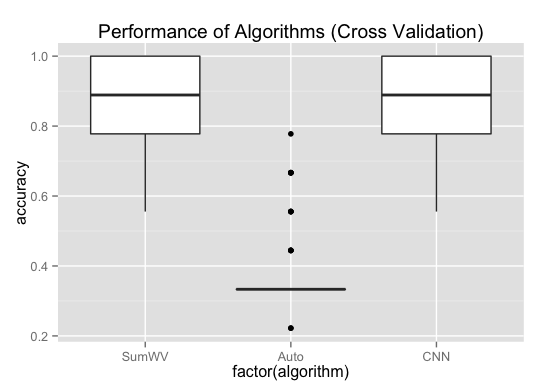

# Short Text Categorization with Word Embeddings

This repository is a collection of algorithms for multi-class classification to short texts using Python. Instead of the bag-of-words representation of texts, word-embedding algorithms with a pre-trained model are used. Currently, Word2Vec is implemented. This package is still *under development*, and *not stable*. Feel free to give suggestions.

So far the following algorithms are implemented:

* SumWord2Vec: each short text is represented by the average of the embedded vectors of all the words.
* Autoencoder: the embedded vectors are passed into an autoencoded representation, where the similarity is calculated by cosine.
* Convolutional Neural Network (CNN): all the words are represented by embedded vectors, which are passed into a convolional neural network.

The Word2Vec model is implemented with [`gensim`](https://radimrehurek.com/gensim/), and CNN with [`keras`](https://keras.io/), with a [`Theano`](http://deeplearning.net/software/theano/) backend.

A cross-validation evaluation on the example dataset shows the boxplot of the performances of various algorithms:

# Useful Links

* Github: [https://github.com/stephenhky/PyShortTextCategorization](https://github.com/stephenhky/PyShortTextCategorization)
* PyPI: [https://pypi.python.org/pypi/shorttext](https://pypi.python.org/pypi/shorttext)
* An [earlier version](https://github.com/stephenhky/PyShortTextCategorization/tree/b298d3ce7d06a9b4e0f7d32f27bab66064ba7afa) of this repository is a demonstration of the following blog post: [Short Text Categorization using Deep Neural Networks and Word-Embedding Models](https://datawarrior.wordpress.com/2016/10/12/short-text-categorization-using-deep-neural-networks-and-word-embedding-models/)

# Further Reading

* Tomas Mikolov, Ilya Sutskever, Kai Chen, Greg Corrado, Jeffrey Dean, "Distributed Representations of Words and Phrases and their Compositionality", *NIPS Proceedings* __26__, 3111-3119 (2013). \[[arXiv](https://arxiv.org/abs/1310.4546)\]
* Yoon Kim, "Convolutional Neural Networks for Sentence Classification" (2014). \[[arXiv](https://arxiv.org/abs/1408.5882)\]
* For a theory of word embeddings, see the WordPress blog entry: [Probabilistic Theory of Word Embeddings: GloVe](https://datawarrior.wordpress.com/2016/07/25/probabilistic-theory-of-word-embeddings-glove/).
* Chunting Zhou, Chonglin Sun, Zhiyuan Liu, Francis Lau, "A C-LSTM Neural Network for Text Classification", arXiv:1511.08630 (2015). \[[arXiv](https://arxiv.org/abs/1511.08630)\]

