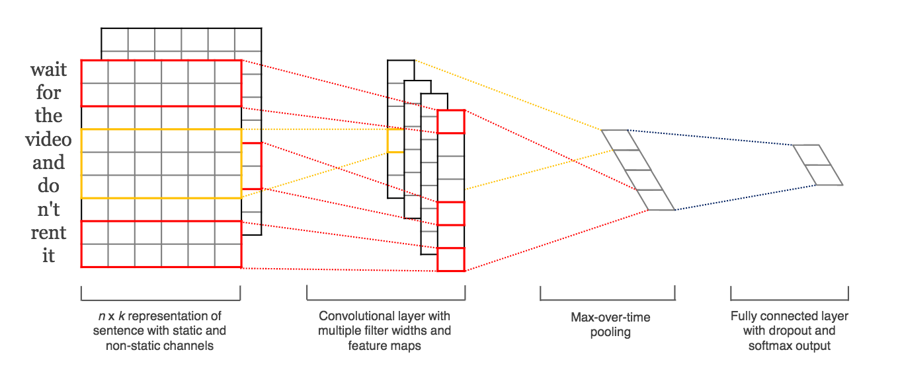
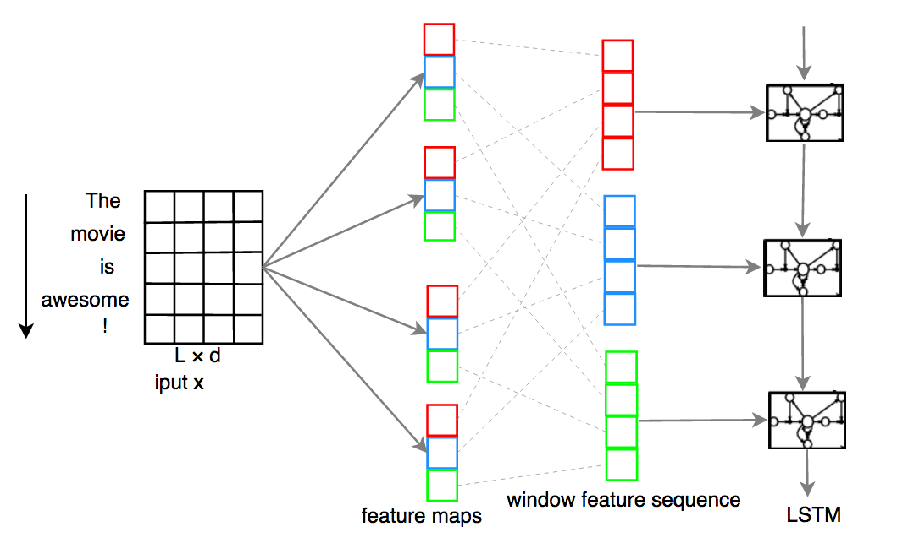

Deep Neural Networks with Word-Embedding
========================================

Wrapper for Neural Networks for Word-Embedding Vectors
------------------------------------------------------

In this package, there is a class that serves a wrapper for various neural network algorithms
for supervised short text categorization:
:class:`shorttext.classifiers.VarNNEmbeddedVecClassifier`.
Each class label has a few short sentences, where each token is converted
to an embedded vector, given by a pre-trained word-embedding model (e.g., Google Word2Vec model).
The sentences are represented by a matrix, or rank-2 array.
The type of neural network has to be passed when training, and it has to be of
type :class:`keras.models.Sequential`. The number of outputs of the models has to match
the number of class labels in the training data.
To perform prediction, the input short sentences is converted to a unit vector
in the same way. The score is calculated according to the trained neural network model.

Some of the neural networks can be found within the module :module:`shorttext.classifiers.embed.nnlib.frameworks`
and they are good for short text or document classification. Of course, users can supply their
own neural networks, written in `keras`.

A pre-trained Google Word2Vec model can be downloaded `here
<https://drive.google.com/file/d/0B7XkCwpI5KDYNlNUTTlSS21pQmM/edit>`_.

See: :doc:`tutorial_wordembed` .

Import the package:

>>> import shorttext

To load the Word2Vec model,

>>> wvmodel = shorttext.utils.load_word2vec_model('/path/to/GoogleNews-vectors-negative300.bin.gz')

Then load the training data

>>> trainclassdict = shorttext.data.subjectkeywords()

Then we choose a neural network. We choose ConvNet:

>>> kmodel = shorttext.classifiers.frameworks.CNNWordEmbed(len(trainclassdict.keys()), vecsize=300)

Initialize the classifier:

>>> classifier = shorttext.classifiers.VarNNEmbeddedVecClassifier(wvmodel, vecsize=300)

Then train the classifier:

>>> classifier.train(trainclassdict, kmodel)
Epoch 1/10
45/45 [==============================] - 0s - loss: 1.0578
Epoch 2/10
45/45 [==============================] - 0s - loss: 0.5536
Epoch 3/10
45/45 [==============================] - 0s - loss: 0.3437
Epoch 4/10
45/45 [==============================] - 0s - loss: 0.2282
Epoch 5/10
45/45 [==============================] - 0s - loss: 0.1658
Epoch 6/10
45/45 [==============================] - 0s - loss: 0.1273
Epoch 7/10
45/45 [==============================] - 0s - loss: 0.1052
Epoch 8/10
45/45 [==============================] - 0s - loss: 0.0961
Epoch 9/10
45/45 [==============================] - 0s - loss: 0.0839
Epoch 10/10
45/45 [==============================] - 0s - loss: 0.0743

Then the model is ready for classification, like:

>>> classifier.score('artificial intelligence')
{'mathematics': 0.57749695, 'physics': 0.33749574, 'theology': 0.085007325}

The trained model can be saved:

>>> classifier.save_compact_model('/path/to/nnlibvec_convnet_subdata.bin')

To load it, enter:

>>> classifier2 = shorttext.classifiers.load_varnnlibvec_classifier(wvmodel, '/path/to/nnlibvec_convnet_subdata.bin')

Putting Word2Vec Model As an Input Keras Layer
^^^^^^^^^^^^^^^^^^^^^^^^^^^^^^^^^^^^^^^^^^^^^^

Since release 0.4.0, `shorttext` allows developers to exploit the new features in `gensim`
to include a word-embedding model as a `keras` layer in defining the `keras` network.
This can be done by setting the `with_gensim` argument to `True` while creating your models as follows.

To load the Word2Vec model,

>>> wvmodel = shorttext.utils.load_word2vec_model('/path/to/gensim/w2vmodel')

Then load the training data

>>> trainclassdict = shorttext.data.subjectkeywords()

Then we choose a neural network. We choose ConvNet and set `with_gensim` as `True`:

>>> keras_model = shorttext.classifiers.frameworks.CNNWordEmbed(wvmodel=wvmodel, nb_labels=len(trainclassdict.keys()), vecsize=100, with_gensim=True)

Initialize the classifier and set `with_gensim` as `True`:

>>> classifier = shorttext.classifiers.VarNNEmbeddedVecClassifier(wvmodel, with_gensim=True, vecsize=100)

Then train the classifier:

>>> classifier.train(trainclassdict, kmodel)
Epoch 1/10
45/45 [==============================] - 0s - loss: 1.3947
Epoch 2/10
45/45 [==============================] - 0s - loss: 1.1783
Epoch 3/10
45/45 [==============================] - 0s - loss: 1.3061
Epoch 4/10
45/45 [==============================] - 0s - loss: 1.0365
Epoch 5/10
45/45 [==============================] - 0s - loss: 0.9559
Epoch 6/10
45/45 [==============================] - 0s - loss: 1.0104
Epoch 7/10
45/45 [==============================] - 0s - loss: 0.7878
Epoch 8/10
45/45 [==============================] - 0s - loss: 0.8632
Epoch 9/10
45/45 [==============================] - 0s - loss: 0.7900
Epoch 10/10
45/45 [==============================] - 0s - loss: 0.7726

Then the model is ready for classification, like:

>>> classifier.score('artificial intelligence')
{'mathematics': 0.22767314, 'physics': 0.14130114, 'theology': 0.63102573}

Provided Neural Networks
------------------------

There are three neural networks available in this package for the use in
:class:`shorttext.classifiers.VarNNEmbeddedVecClassifier`,
and they are available in the module :module:`shorttext.classifiers.frameworks`.

ConvNet (Convolutional Neural Network)
^^^^^^^^^^^^^^^^^^^^^^^^^^^^^^^^^^^^^^

This neural network for supervised learning is using convolutional neural network (ConvNet),
as demonstrated in Kim's paper.

The function in the frameworks returns a :class:`keras.models.Sequential` or :class:`keras.models.Model`. Its input parameters are:

`CNNWordEmbed(nb_labels, wvmodel=None, nb_filters=1200, n_gram=2, maxlen=15, vecsize=100, cnn_dropout=0.0, final_activation='softmax', dense_wl2reg=0.0, dense_bl2reg=0.0, optimizer='adam', with_gensim=False)`

* nb_labels (int) – number of class labels
* wvmodel (gensim.models.keyedvectors.KeyedVectors) – pre-trained Gensim word2vec model
* nb_filters (int) – number of filters (Default: 1200)
* n_gram (int) – n-gram, or window size of CNN/ConvNet (Default: 2)
* maxlen (int) – maximum number of words in a sentence (Default: 15)
* vecsize (int) – length of the embedded vectors in the model (Default: 100)
* cnn_dropout (float) – dropout rate for CNN/ConvNet (Default: 0.0)
* final_activation (str) – activation function. Options: softplus, softsign, relu, tanh, sigmoid, hard_sigmoid, linear. (Default: ‘softmax’)
* dense_wl2reg (float) – L2 regularization coefficient (Default: 0.0)
* dense_bl2reg (float) – L2 regularization coefficient for bias (Default: 0.0)
* optimizer (str) – optimizer for gradient descent. Options: sgd, rmsprop, adagrad, adadelta, adam, adamax, nadam. (Default: adam)
* with_gensim (bool) – boolean variable to indicate if the word-embeddings being used derived from a Gensim’s Word2Vec model. (Default: True)

The parameter `maxlen` defines the maximum length of the sentences. If the sentence has less than `maxlen`
words, then the empty words will be filled with zero vectors.

>>> kmodel = fr.CNNWordEmbed(len(trainclassdict.keys()))

Or if you want to include word-embedding layer, do this: (`shorttext` >= 0.4.0)

>>> wvmodel = shorttext.utils.load_word2vec_model('/path/to/gensim/w2vmodel')
>>> kmodel = fr.CNNWordEmbed(wvmodel=wvmodel, nb_labels=len(trainclassdict.keys()), vecsize=100, with_gensim=True)

Double ConvNet
^^^^^^^^^^^^^^

This neural network is nothing more than two ConvNet layers. The function in the frameworks returns a :class:`keras.models.Sequential` or :class:`keras.models.Model`. Its input parameters are:

`DoubleCNNWordEmbed(nb_labels, wvmodel=None, nb_filters_1=1200, nb_filters_2=600, n_gram=2, filter_length_2=10, maxlen=15, vecsize=100, cnn_dropout_1=0.0, cnn_dropout_2=0.0, final_activation='softmax', dense_wl2reg=0.0, dense_bl2reg=0.0, optimizer='adam', with_gensim=False)`

* nb_labels (int) – number of class labels
* wvmodel (gensim.models.keyedvectors.KeyedVectors) – pre-trained Gensim word2vec model
* nb_filters_1 (int) – number of filters for the first CNN/ConvNet layer (Default: 1200)
* nb_filters_2 (int) – number of filters for the second CNN/ConvNet layer (Default: 600)
* n_gram (int) – n-gram, or window size of first CNN/ConvNet (Default: 2)
* filter_length_2 (int) – window size for second CNN/ConvNet layer (Default: 10)
* maxlen (int) – maximum number of words in a sentence (Default: 15)
* vecsize (int) – length of the embedded vectors in the model (Default: 100)
* cnn_dropout_1 (float) – dropout rate for the first CNN/ConvNet layer (Default: 0.0)
* cnn_dropout_2 (float) – dropout rate for the second CNN/ConvNet layer (Default: 0.0)
* final_activation (str) – activation function. Options: softplus, softsign, relu, tanh, sigmoid, hard_sigmoid, linear. (Default: ‘softmax’)
* dense_wl2reg (float) – L2 regularization coefficient (Default: 0.0)
* dense_bl2reg (float) – L2 regularization coefficient for bias (Default: 0.0)
* optimizer (str) – optimizer for gradient descent. Options: sgd, rmsprop, adagrad, adadelta, adam, adamax, nadam. (Default: adam)

The parameter `maxlen` defines the maximum length of the sentences. If the sentence has less than `maxlen`
words, then the empty words will be filled with zero vectors.

>>> kmodel = fr.DoubleCNNWordEmbed(len(trainclassdict.keys()))

Or if you want to include word-embedding layer, do this: (`shorttext` >= 0.4.0)

>>> wvmodel = shorttext.utils.load_word2vec_model('/path/to/gensim/w2vmodel')
>>> kmodel = fr.DoubleCNNWordEmbed(wvmodel=wvmodel, nb_labels=len(trainclassdict.keys()), vecsize=100, with_gensim=True)

C-LSTM (Convolutional Long Short-Term Memory)
^^^^^^^^^^^^^^^^^^^^^^^^^^^^^^^^^^^^^^^^^^^^^

This neural network for supervised learning is using C-LSTM, according to the paper
written by Zhou *et. al.* It is a neural network with ConvNet as the first layer,
and then followed by LSTM (long short-term memory), a type of recurrent neural network (RNN).

The function in the frameworks returns a :class:`keras.models.Sequential` or :class:`keras.models.Model`.

`CLSTMWordEmbed(nb_labels, wvmodel=None, nb_filters=1200, n_gram=2, maxlen=15, vecsize=100, cnn_dropout=0.0, nb_rnnoutdim=1200, rnn_dropout=0.2, final_activation='softmax', dense_wl2reg=0.0, dense_bl2reg=0.0, optimizer='adam', with_gensim=False)`

* nb_labels (int) – number of class labels
* wvmodel (gensim.models.keyedvectors.KeyedVectors) – pre-trained Gensim word2vec model
* nb_filters (int) – number of filters (Default: 1200)
* n_gram (int) – n-gram, or window size of CNN/ConvNet (Default: 2)
* maxlen (int) – maximum number of words in a sentence (Default: 15)
* vecsize (int) – length of the embedded vectors in the model (Default: 100)
* cnn_dropout (float) – dropout rate for CNN/ConvNet (Default: 0.0)
* nb_rnnoutdim (int) – output dimension for the LSTM networks (Default: 1200)
* rnn_dropout (float) – dropout rate for LSTM (Default: 0.2)
* final_activation (str) – activation function. Options: softplus, softsign, relu, tanh, sigmoid, hard_sigmoid, linear. (Default: ‘softmax’)
* dense_wl2reg (float) – L2 regularization coefficient (Default: 0.0)
* dense_bl2reg (float) – L2 regularization coefficient for bias (Default: 0.0)
* optimizer (str) – optimizer for gradient descent. Options: sgd, rmsprop, adagrad, adadelta, adam, adamax, nadam. (Default: adam)

The parameter `maxlen` defines the maximum length of the sentences. If the sentence has less than `maxlen`
words, then the empty words will be filled with zero vectors.

>>> kmodel = fr.CLSTMWordEmbed(len(trainclassdict.keys()))

Or if you want to include word-embedding layer, do this: (`shorttext` >= 0.4.0)

>>> wvmodel = shorttext.utils.load_word2vec_model('/path/to/gensim/w2vmodel')
>>> kmodel = fr.CLSTMWordEmbed(wvmodel=wvmodel, nb_labels=len(trainclassdict.keys()), vecsize=100, with_gensim=True)

User-Defined Neural Network
^^^^^^^^^^^^^^^^^^^^^^^^^^^

Users can define their own neural network for use in the classifier wrapped by
:class:`shorttext.classifiers.VarNNEmbeddedVecClassifier`
as long as the following criteria are met:

- the input matrix is :class:`numpy.ndarray`, and of shape `(maxlen, vecsize)`, where
`maxlen` is the maximum length of the sentence, and `vecsize` is the number of dimensions
of the embedded vectors. The output is a one-dimensional array, of size equal to
the number of classes provided by the training data. The order of the class labels is assumed
to be the same as the order of the given training data (stored as a Python dictionary).

Reference
---------

Chunting Zhou, Chonglin Sun, Zhiyuan Liu, Francis Lau, "A C-LSTM Neural Network for Text Classification," (arXiv:1511.08630). [`arXiv
<https://arxiv.org/abs/1511.08630>`_]

"CS231n Convolutional Neural Networks for Visual Recognition," Stanford Online Course. [`link
<http://cs231n.github.io/convolutional-networks/>`_]

Tal Perry, "Convolutional Methods for Text," *Medium* (2017). [`Medium
<https://medium.com/@TalPerry/convolutional-methods-for-text-d5260fd5675f>`_]

Yoon Kim, "Convolutional Neural Networks for Sentence Classification," *EMNLP* 2014, 1746-1751 (arXiv:1408.5882). [`arXiv
<https://arxiv.org/abs/1408.5882>`_]

Zackary C. Lipton, John Berkowitz, "A Critical Review of Recurrent Neural Networks for Sequence Learning," arXiv:1506.00019 (2015). [`arXiv
<https://arxiv.org/abs/1506.00019>`_]

Home: :doc:`index`